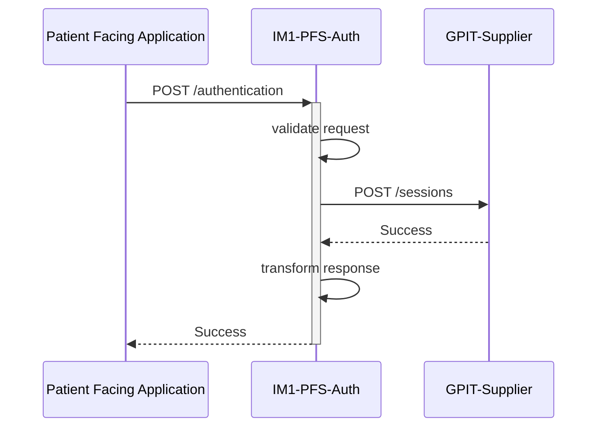

# IM1 Patient Facing Service Auth

[](https://github.com/NHSDigital/im1-pfs-auth/actions/workflows/cicd-1-pull-request.yaml)
[](https://sonarcloud.io/summary/new_code?id=im1-pfs-auth)

This is an intermediary service enabling proxies to act on behalf of patients, regardless of their GP practice. It provides an API proxy and logic layer for integrating with GP practices.

TODO: Add section on getting local environment set up and on deployment

## Table of Contents

- [IM1 Patient Facing Service Auth](#im1-patient-facing-service-auth)
  - [Table of Contents](#table-of-contents)
  - [Setup](#setup)
    - [Prerequisites](#prerequisites)
    - [Configuration](#configuration)
  - [Design](#design)
    - [Diagrams](#diagrams)
  - [Contributing](#contributing)
  - [Licence](#licence)


## Repository Structure

This repository includes:

- [specification/im1-pfs-auth-api.yaml](./specificationim1-pfs-auth-api.yaml) - The [Open API Specification](https://swagger.io/docs/specification/about/) describes the endpoints, methods and messages exchanged by the API. Used to generate interactive documentation for the NHS API Catalogue; the contract between the API and its consumers.
- `sandbox/` - A flask (Python) API that implements a mock implementation of the service. It's to be used as interactive documentation to illustrate interactions and concepts. It is not intended to provide an exhaustive/faithful environment suitable for full development and testing.
- `scripts/` - Utilities helpful to developers for the development and release of the specification.

## Setup

Clone the repository

```shell
git clone https://github.com/NHSDigital/im1-pfs-auth.git
cd im1-pfs-auth
```

### Prerequisites

The following software packages, or their equivalents, are expected to be installed and configured:

- [Docker](https://www.docker.com/) container runtime or a compatible tool, e.g. [Podman](https://podman.io/),
- [asdf](https://asdf-vm.com/) version manager,
- [GNU make](https://www.gnu.org/software/make/) 3.82 or later,
- [Python](https://www.python.org/) the latest version
- [uv](https://docs.astral.sh/uv/) Python package manager

### Configuration

Installation and configuration of the toolchain dependencies.

```shell
make install
```

### Testing

There are multiple layers of testing which can be run from a local machine.

To run the sandbox unit tests run the following command:

```shell
make sandbox-test
```

More to follow...

## Design

### Diagrams

Here is a mermaid sequence diagram for the available endpoints and interactions with our service to third parties.



## Contributing

Contributions to this project are welcome from anyone, providing that they conform to the [guidelines for contribution](./docs/developer-guides/CONTRIBUTING.md) and the [community code of conduct](./docs/developer-guides/CODE_OF_CONDUCT.md).

## Licence

This project is licensed under the MIT License - see the [LICENCE](./LICENCE.md) file for details.

Any new work added to this repository must conform to the conditions of these licenses. In particular this means that this project may not depend on GPL-licensed or AGPL-licensed libraries, as these would violate the terms of those libraries' licenses.

The contents of this repository are protected by Crown Copyright (C).
