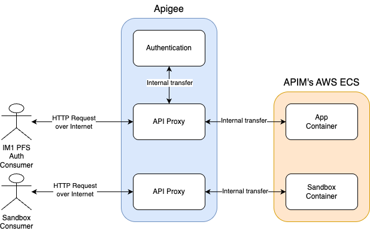

# IM1 Patient Facing Service Auth

[](https://github.com/NHSDigital/im1-pfs-auth/actions/workflows/cicd-1-pull-request.yaml)
[](https://sonarcloud.io/summary/new_code?id=im1-pfs-auth)

This is an intermediary service enabling proxies to act on behalf of patients, regardless of their GP practice. It provides an API proxy and logic layer for integrating with GP practices.

TODO: Add section on getting local environment set up and on deployment

## Table of Contents

- [IM1 Patient Facing Service Auth](#im1-patient-facing-service-auth)
  - [Table of Contents](#table-of-contents)
  - [Setup](#setup)
    - [Prerequisites](#prerequisites)
    - [Configuration](#configuration)
  - [Usage](#usage)
    - [Repository Structure](#repository-structure)
    - [Key Components](#key-components)
      - [Apigee](#apigee)
      - [App](#app)
      - [App Structure](#app-structure)
      - [Sandbox](#sandbox)
    - [Usage TODO](#usage-todo)
      - [Deployment](#deployment)
        - [Deployment Limits](#deployment-limits)
    - [Testing](#testing)
      - [Unit Tests](#unit-tests)
      - [End to End Tests](#end-to-end-tests)
  - [Design](#design)
    - [Diagrams](#diagrams)
  - [Contributing](#contributing)
  - [Licence](#licence)

## Setup

Clone the repository

```shell
git clone https://github.com/NHSDigital/im1-pfs-auth.git
cd im1-pfs-auth
```

### Prerequisites

The following software packages, or their equivalents, are expected to be installed and configured:

- [Docker](https://www.docker.com/) container runtime or a compatible tool, e.g. [Podman](https://podman.io/),
- [asdf](https://asdf-vm.com/) version manager,
- [GNU make](https://www.gnu.org/software/make/) 3.82 or later,
- [Python](https://www.python.org/) the latest version
- [uv](https://docs.astral.sh/uv/) Python package manager
- [yq](https://github.com/mikefarah/yq) command line YAML processor
- [Node.js](https://nodejs.org/) 22 or later

### Configuration

Installation of the toolchain dependencies.

```shell
make install
```

## Usage

### Repository Structure

Key folders for the project are:

- `.github` contains GitHub Actions workflows for CI/CD.
- `app` contains the backend application code for the API.
- `docs` contains the documentation for the API, including user guides, developer guides, and design documents.
- `postman` contains Postman collections for users to trial the sandbox environment.
- `proxygen` contains support files for the [proxygen CLI](./docs/user-guides/Proxygen_CLI.md).
- `sandbox` contains a flask application that is used to simulate the backend service for the API. When deployed the sandbox will be accessible without authentication.
- `scripts` contains scripts that are used to automate the development and deployment processes. As well as configuration files for tools the project uses.
- `specification` contains the OpenAPI specification for the API.
- `tests` contains the tests for the API.

### Key Components

#### Apigee

Apigee is the API management platform used to deploy and manage the API. It provides features such as security, analytics, and monitoring for our API.

#### App

The app is the core component of the API, containing the business logic and data access layers. It is responsible for the processing of requests and responses, such as validating the NHS login proxy token and initiating a session with the supplier system based on ODS code.

#### App Structure

The application is to aims to apply domain driven design by incorporating a decoupled architecture that separates core business lock from infrastructure concerns.

- Domain: Contains business logic and rules, independent of frameworks or external systems. 
- Application: Orchestrates the use cases (the thins the system needs to do to serve the business i.e. forward request on to GPIT)
- Infrastructure: Technical implementations required by the Domain and Application layers.
- App: How the application is presented to the outside world

#### Sandbox

The sandbox is a testing environment that simulates the behaviour of the API without affecting the production environment. It allows developers to experiment with `im1-pfs-auth` APIs without onboarding or authenticating their requests.

### Usage TODO

After a successful installation, provide an informative example of how this project can be used. Additional code snippets, screenshots and demos work well in this space. You may also link to the other documentation resources, e.g. the [User Guide](./docs/user-guide.md) to demonstrate more use cases and to show more features.

#### Deployment

The application is deployed mainly using [Proxygen CLI](./docs/user-guides/Proxygen_CLI.md). Proxygen CLI manages all the infrastructure and deployment of the application.

For the API to be functional a docker container must be pushed to APIM's container registry. This container will then be referenced in the proxygen deployment make command to deploy the Apigee API Proxy with the correct backend container.


For more information on how to deploy the application, please refer to the [Apigee Deployment Guide](./docs/user-guides/Deployment_Guide.md).

##### Deployment Limits

Deployment limits information can be found in [confluence](https://nhsd-confluence.digital.nhs.uk/spaces/APM/pages/678899059/Deploying+your+API+with+Proxy+Generator#DeployingyourAPIwithProxyGenerator-APIconfig)

### Testing

There are multiple layers of testing which can be run from a local machine.

#### Unit Tests

To run the app unit tests run the following command:

```shell
make app-unit-test
```

To run the sandbox unit tests run the following command:

```shell
make sandbox-unit-test
```

#### End to End Tests

To run end to end tests use the following commands:

> [!NOTE]
> Proxygen must be set up to run end to end tests.

```shell
export APIGEE_ACCESS_TOKEN=$(proxygen pytest-nhsd-apim --api=im1-pfs-auth get-token | jq -r .pytest_nhsd_apim_token)
export TEST_APP_KEYCLOAK_CLIENT_ID=KEYCLOAK_CLIENT_ID
export TEST_APP_KEYCLOAK_CLIENT_SECRET=KEYCLOAK_SECRET
export TEST_APP_API_KEY=APP_CLIENT_API_KEY
export TEST_APP_PRIVATE_KEY=$(cat {path_to_private_key.pem})
make end-to-end-tests PROXYGEN_URL_PATH=im1-pfs-auth-pr-46 PROXY_NAME=im1-pfs-auth APIGEE_PROXY_NAME=im1-pfs-auth--internal-dev--im1-pfs-auth-pr-46
```

- `TEST_APP_KEYCLOAK_CLIENT_ID`: Client Id issued to the mocked authorisation provider client. Obtained by the GET Keycloak credentials endpoint.
- `TEST_APP_KEYCLOAK_CLIENT_SECRET`: Secret assigned to the mocked authorisation provider client. Obtained by the GET Keycloak credentials endpoint.
- `TEST_APP_API_KEY`: API Key for test application in the developer portal (https://dos-internal.ptl.api.platform.nhs.uk/MyApplications)
- `TEST_APP_PRIVATE_KEY`: Private Key from key pair for test application in the developer portal (https://dos-internal.ptl.api.platform.nhs.uk/MyApplications)
- `PROXYGEN_URL_PATH`: The URL path for the Proxygen API (e.g. im1-pfs-auth-pr-31)
- `PROXY_NAME`: The name of the proxy (e.g. im1-pfs-auth)
- `APIGEE_PROXY_NAME`: The name of the proxy to test (e.g., im1-pfs-auth--internal-dev--im1-pfs-auth-pr-31)

## Design

### Diagrams

Here is a mermaid sequence diagram for the available endpoints and interactions with our service to third parties.


Here is a diagram showing the internal interactions within the API platform as well as where each component is hosted.



## Contributing

Contributions to this project are welcome from anyone, providing that they conform to the [guidelines for contribution](./docs/developer-guides/CONTRIBUTING.md) and the [community code of conduct](./docs/developer-guides/CODE_OF_CONDUCT.md).

## Licence

This project is licensed under the MIT License - see the [LICENCE](./LICENCE.md) file for details.

Any new work added to this repository must conform to the conditions of these licenses. In particular this means that this project may not depend on GPL-licensed or AGPL-licensed libraries, as these would violate the terms of those libraries' licenses.

The contents of this repository are protected by Crown Copyright (C).
