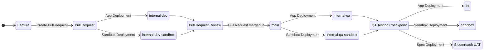

# Environments

## Table of Contents

- [Environments](#environments)
  - [Table of Contents](#table-of-contents)
  - [APIM Environments](#apim-environments)
    - [Bloomreach Environments](#bloomreach-environments)
  - [Deployment Flow](#deployment-flow)

## APIM Environments

Environments can be broken down into one of two types:

| Name    | Description                                                                                                                                       |
| ------- | ------------------------------------------------------------------------------------------------------------------------------------------------- |
| sandbox | Sandbox environments are publicly accessible environments that host a limited/mocked version of our application                                   |
| app     | Environments that are not of type sandbox. These environment require authentication and contain application code within their deployed container. |

IM1 PFS Auth current has the following types of application and sandbox environments. An environment in this context is an Apigee URL connected to the im1-pfs-auth ECS container.

> [!TIP]
> For information on deploying see [Deploying to Apigee](./Deploy_To_Apigee.md)

| Name                 | Type    | Purpose                                                                                                               | Number of environments                 | Access                                                      | URL                                                                                                                                |
| -------------------- | ------- | --------------------------------------------------------------------------------------------------------------------- | -------------------------------------- | ----------------------------------------------------------- | ---------------------------------------------------------------------------------------------------------------------------------- |
| internal-dev         | app     | Development and testing app environment. Only used to test Pull Requests. Used before a feature is ready for main     | 1+ (depending on number of active PRs) | Public, authentication requires development composite token | [https://internal-dev.api.service.nhs.uk/<url_path_part>](https://internal-dev.api.service.nhs.uk/<url_path_part>)                 |
| internal-dev-sandbox | sandbox | Development and testing sandbox environment. Only used to test Pull Requests. Used before a feature is ready for main | 1+ (depending on number of active PRs) | Public, no authentication                                   | [https://internal-dev-sandbox.api.service.nhs.uk/<url_path_part>](https://internal-dev-sandbox.api.service.nhs.uk/<url_path_part>) |
| internal-qa          | app     | Integration environment for development team, where main is deployed to on each commit.                               | 1                                      | Public, authentication requires development composite token | [https://internal-qa.api.service.nhs.uk/im1-pfs-auth](https://internal-qa.api.service.nhs.uk/im1-pfs-auth)                         |
| internal-qa-sandbox  | sandbox | Integration environment for development team, where main is deployed to on each commit.                               | 1                                      | Public, no authentication                                   | [https://internal-qa-sandbox.api.service.nhs.uk/im1-pfs-auth](https://internal-qa-sandbox.api.service.nhs.uk/im1-pfs-auth)         |
| int                  | app     | Integration environment for NHS and other allowed consumers to integrate and test against im1-pfs-auth                | 1                                      | Public, authentication requires development composite token | [https://int.api.service.nhs.uk/im1-pfs-auth](https://int.api.service.nhs.uk/im1-pfs-auth)                                         |
| sandbox              | sandbox | Early integration environment for the public to use to get a flavour of our API.                                      | 1                                      | Public, no authentication                                   | [https://sandbox.api.service.nhs.uk/im1-pfs-auth](https://sandbox.api.service.nhs.uk/im1-pfs-auth)                                 |
| prod                 | app     |                                                                                                                       | 1                                      | Public, authentication requires production composite token  | TBD                                                                                                                                |

Each environment has a GitHub environment associated with it which could be used to protect deployments.

> [!NOTE]
> More APIM environments exist, for information on environment im1-pfs-auth does not use review [APIM Environments](https://nhsd-confluence.digital.nhs.uk/spaces/APM/pages/110873804/Environments)
>
> Or for limits on [APIM environments](https://nhsd-confluence.digital.nhs.uk/spaces/APM/pages/678899059/Deploying+your+API+with+Proxy+Generator#DeployingyourAPIwithProxyGenerator-APIconfig)

### Bloomreach Environments

Bloomreach environments are when the specification is hosted. This allows consumers our APIs to review the documentation for the API and how to begin onboarding to our API.

| Name | Purpose         | Access                                                       |
| ---- | --------------- | ------------------------------------------------------------ |
| UAT  | internal review | Access through NHS network via VDI or HSCN VPN or NHS office |
| Prod | production      | Public page on API Catalogue                                 |

## Deployment Flow

The deployment flow for im1-pfs-auth is as follows:

